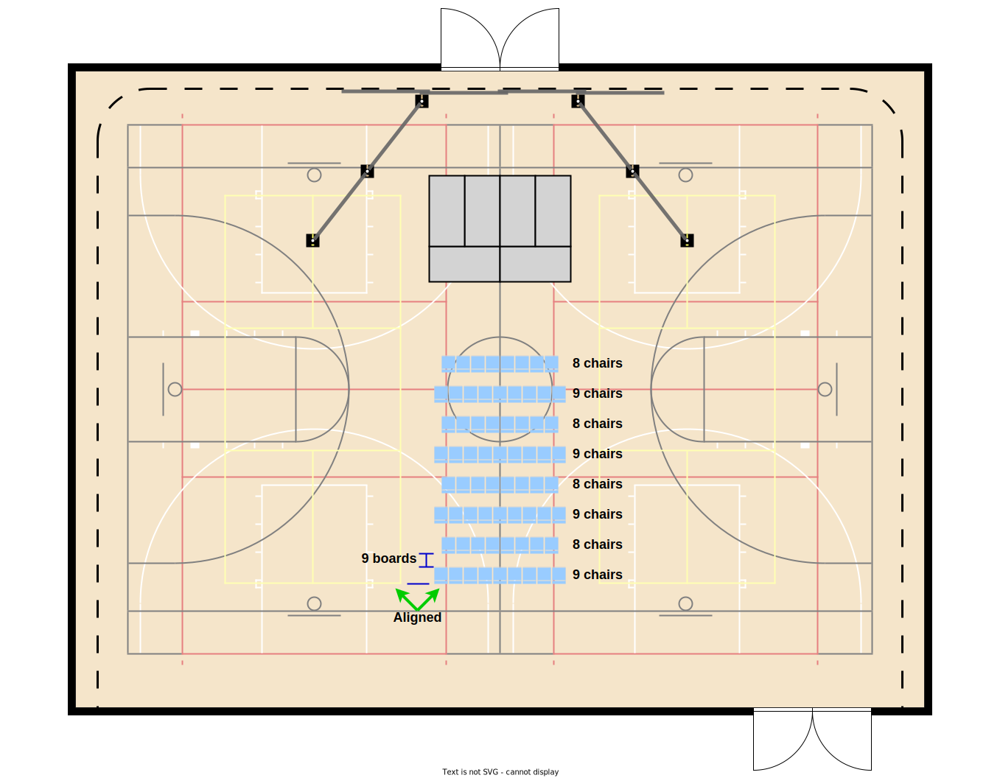

# Chair Setup

<caption>Figure 1: Final configuration</caption>

## A. Center section

As seen in figure 2, the center chairs are alternating rows of 8 and 9 with 9 boards (~18 inches) between the front and back of each row.  The back of the back row aligns with the yellow line of the pickle ball court.

<caption>Figure 2: Center section of chairs</caption>

1. Start with back row:
    1. Place the left chair just outside the red line with the back aligned with the yellow line.
    2. Fill the row with 9 chairs.
    3. Check that the center chair is on top of the black center court line.
3. Move forward one row:
    1. Place the left chair forward 9 boards from the previous row and centered between the last two chairs of the previous row.
    2. Fill the row with 8 chairs.
    3. Check that the black center court line is between the two center chairs.
4. Continue with alternating rows of 8 and 9 chairs until 8 rows are placed.

## B. Back row of side sections

As seen in figure 3, the back row of is a row of 11 chairs. The back of the inner chair is on the yellow line (see arrow A). The front outer leg of the second chair is on the white line (see arrow B). The outside chair is lined up with the second row of the center section of chairs (see arrows C and D).

<caption>Figure 3: Back row of side sections</caption>

1. Start with inner two chairs:
    1. Place the innermost chair with the back on the yellow line (arrow A)
    2. Place the second chair so that its outer leg is on the white line (arrow B)
2. Continue placing chairs until 11 chairs have been placed
3. Rotate the chairs until the outer chair is visually aligned with the second back row of the center section (arrows C and D)

## C. Remaining rows of the side sections

As seen in figure 4, the side sections are finished by placing rows with 1 less chair 9 boards (~18 inches) in front of the preceding row. The innermost chair aligns with the outside edge of the preceding row.

<caption>Figure 4: Remaingin rows of the side sections</caption>

1. Place the innermost chair forward 9 boards from the previous row with the inner side aligned with the preceding rows innermost chair.
2. Place the second chair following the same angle as the preceding row, checking that the outer front leg is on the white line.
3. Continue placing chairs following the same angle as the preceding row until the row has one less chair than the preceding row.
4. Move forward one row and repeat steps 1-3 until 8 rows are placed.